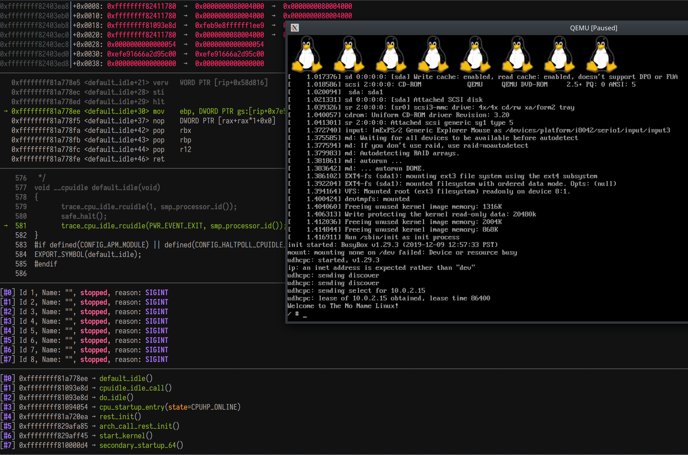
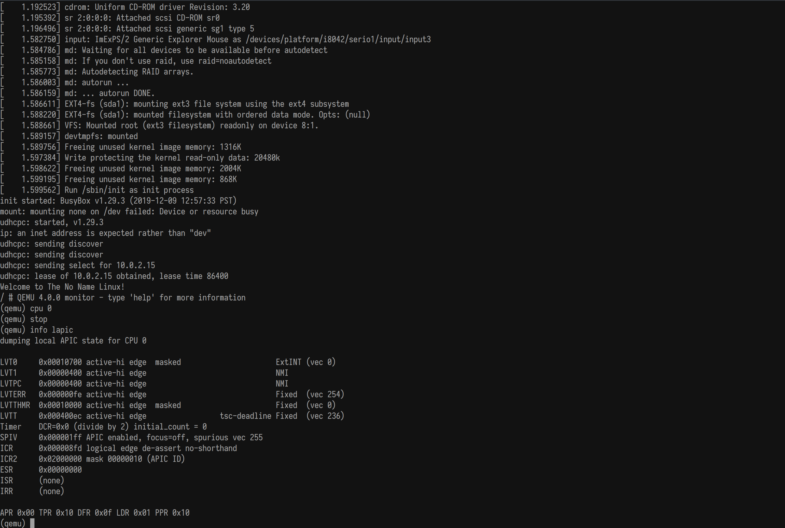

## No Name Linux

This repo helps to build and run the Linux kernel and busybox for the user land.
The scripts incorporate knowledge needed to facilitate ramping up on the Linux kernel 
debugging.

Eye candy:
1. Debugging Linux kernel


2. Serial console, inspecting Local APIC for CPU 0 with QEMU


To clone:
```
	git clone --recursive https://github.com/kromych/no-name-linux.git
```
To build the kernel:
```
	./01-build-kernel.sh
```
To build the root filesystem:
```
	./02-build-rootfs.sh 
```
To build the bootable image (you can also use it to boot a PC)
```
	./03-mkimg-losetup.sh
```

To run:
```
	./run.sh
```

To debug:
```
	./run.sh waitdebug
```
and run `./attach-gdb.sh` in another console window/tab.

To supress graphic output, and run in the text mode:
```
	./run.sh serial
```
In this case, you'll need to use `Ctrl+A` followed by `C` to QEMU's monitor.
