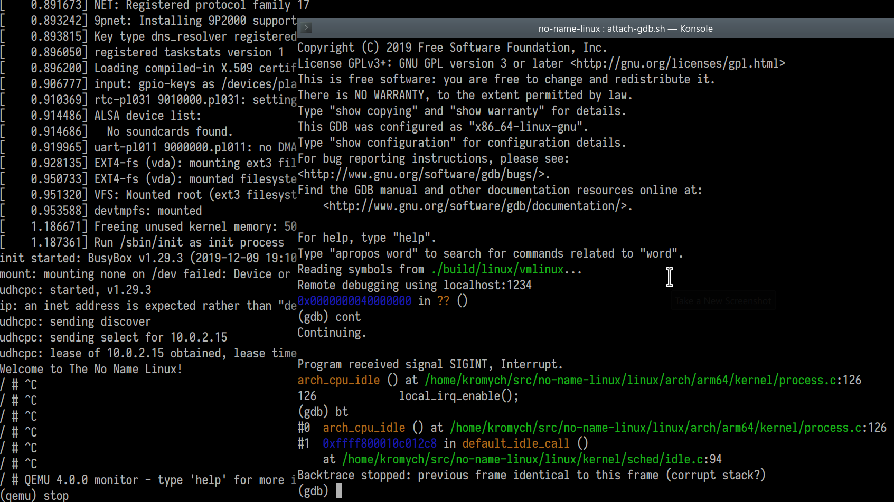
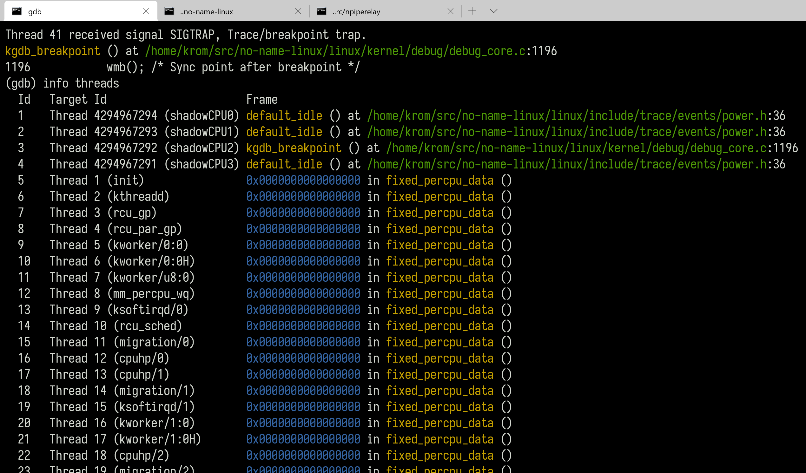

## No Name Linux

This repo helps to build and run the Linux kernel and busybox for the user land.
The scripts incorporate knowledge needed to facilitate ramping up on the Linux kernel 
debugging.

Also there is an example of building an out-of-tree kernel module [LookSee](./lookseemod/looksee.c)

> For `arm64`, please switch to the `arm64` branch.
> I'll merge it into `master` when I have time.

> For Hyper-V, please switch to the hyper-v branch.
> I'll merge it into `master` when I have time.


Eye candy:
1. Debugging Linux kernel


2. Serial console, inspecting Local APIC for CPU 0 with QEMU


3. Debugging the ARM64 Linux kernel


4. [What exactly happens inside the kernel when you divide by zero in your user-mode code](./notes/div-by-zero.md)

5. Linux Kernel debugging under Hyper-V 


To clone:
```
	git clone --recursive https://github.com/kromych/no-name-linux.git
```

To debug:

1. Build the root fs
2. Build the kernel
3. Create a VHDX virtual disk using the helper function in the powershell script
4. Create a Hyper-V Gen 2 VM with security boot disabled.
5. Add 2 serial ports to the VM:
```
Set-VmComPort -Pipe \\.\pipe\Com1 -Number 1 -DebuggerMode Off
Set-VmComPort -Pipe \\.\pipe\Com2 -Number 2 -DebuggerMode Off    
```
6. Use  to setup kernel debugging relay
```
serial-relay //./pipe/Com2 kgdb &
```
7. Inside gdb,
```
target remote /dev/pts/3
```
8. Inside the Linux shell,
```
echo g > /proc/sysrq-trigger
```
